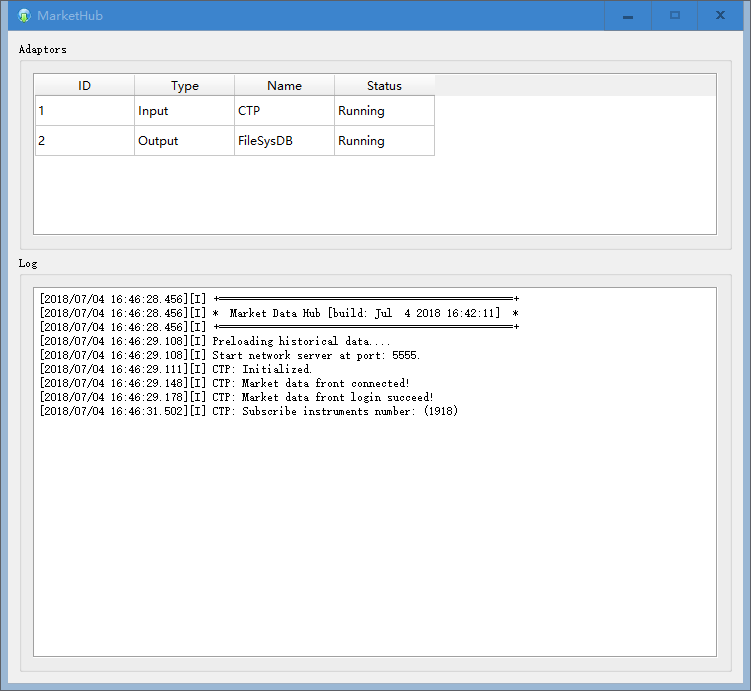

# MarketHub: Market data hub for CTP tick data capturing and transferring
---
# 说明
MarketHub是一个使用C++编写的国内期货数据收集与中转程序。

# 功能
1. 基于CTP的tick数据收集，收集的数据以csv文件形式保存于硬盘中。
2. 可指定每日自动重启时间，做到无人值守。
3. 配合MySQL或其它数据库，可将实时tick与历史数据合并成连续的行情数据。
4. 对外以web形式提供服务，其它应用可以向MarketHub请求各种周期的数据。
5. 异常情况自动email报警。
6. 界面以Qt编写，组件化设计，方便部署到Windows与Linux平台中。

# 配置
MarketHub的配置文件为MarketHub.ini，其中各节的配置项说明如下：  
  

[Adaptors]   # 配置加载的组件，正常使用时无须修改  
CtpAdaptor.dll  
FileSysDB.dll

[CTP]    # 配置CTP账户，用户密码可加密  
BrokerID = xxxx  
MdFront = xxxx  
TradeFront = xxxx  
UserName = xxxx  
UserPwd = xxxx  
SubscribeAllQuotes = true  
  
[MySQL]  # 配置MySQL账户，如果仅用于数据采集，则无需配置  
IP=xxxx  
Port=xxxx  
User=xxxx  
Password = xxxx  
  
[Server]  # 如果向其它程序提供数据，则打开以下选项  
Enable=false  
Port=5555  
  
[Mail]  # 异常情况邮件报警  
Enable = false  
Sender = log@algo.trade  
Password = xxxx  
Server = xxxx  
Port = 465  
Receiver = log@algo.trade  
SilentTime = 02:30:00-08:45:00;15:30:00-20:45:00  

[Restart]  # 每日重启时间，由于CTP平台每日结算后会断线，所以让程序每日自动重启  
08:50:00    
20:50:00  

[Preload]  # 预加载数据，可以不配置  
ru1709,1,MINUTE,2000,CSV #instrument,interval,resolution,number,data source  

# 如何使用（Windows平台）
 修改完配置文件之后，直接运行MarketHub.exe。程序会根据配置每天自动重启，收集的Tick数据保存在同一目录的Data文件夹下。  

  